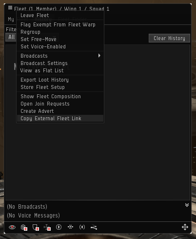

# Fleet

The fleet resource provides details about a fleet. The fleet resource, along with all its children resources, may only be accessed with an access token belonging to the fleet boss.

- **Route:** URL must be provided by user. It can be obtained in the client, under the fleet menu, by using the *Copy External Fleet Link* option. The URL will be copied to the clipboard.

  

- **Example URL:** `https://crest-tq.eveonline.com/fleets/1060711261968/`

### GET

- **Cache:** 5 seconds
- **Scope:** `fleetRead`

#### Sample Response

**Media type:** `application/vnd.ccp.eve.Fleet-v1+json`

```json
{
  "isVoiceEnabled": false,
  "motd": "This is an <b>awesome</b> fleet!",
  "isFreeMove": false,
  "isRegistered": false,
  "members": {
    "href": "https://crest-tq.eveonline.com/fleets/1060711261968/members/"
  },
  "wings": {
    "href": "https://crest-tq.eveonline.com/fleets/1060711261968/wings/"
  }
}
```

#### Response Details

- `isVoiceEnabled`: Is EVE Voice enabled.
- `motd`: Fleet MOTD in CCP flavoured HTML.
- `isFreeMove`: Is free-move enabled.
- `isRegistered`: Does the fleet have an active fleet advertisement.
- `members`: Contains link to the fleet's members collection.
- `wings`: Contains link to the fleet's wings collection.

### PUT

- **Scope:** `fleetWrite`

#### Sample Request

**Media type:** `application/vnd.ccp.eve.FleetUpdate-v1+json`

```json
{
	"isFreeMove": true,
	"motd": "This is an <b>awesome</b> fleet, and it needs an even <font size=24 color=#ffff0000>more awesome</font> MOTD!!!"
}
```

#### Request Details

- `isFreeMove`: Should free-move be enabled in the fleet. Optional.
- `motd`: New fleet MOTD in CCP flavoured HTML. Optional.

## References

- [Patch notes](https://community.eveonline.com/news/patch-notes/patch-notes-for-eve-online-citadel) for EVE Online: Citadel
